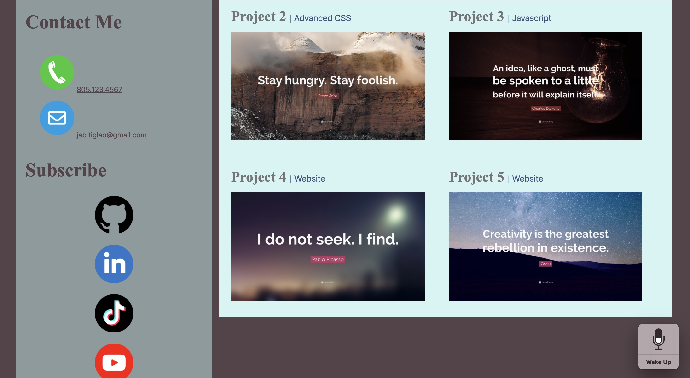

# 02 Advanced CSS: Portfolio

## Description

The purpose of this project is to build a portfolio page that will showcase my skills and talents as a web developer, giving would-be employers who are looking to fill-in full-time or part-time positions an idea of the projects I have worked on, my strongest points, as well as the thought processes that went behind each of my projects.

Since I have started working on this page at the beginning of the boot camp, it is expected that the portfolio will not only highlight the skills I have gained in the course of the program, but will also document my progress as I apply every programming lesson I have learned in class to develop the portfolio. I am interested to see how far I have come, from a student who didn't have a strong foundational knowledge on HTML and CSS, or any of the programming languages I will be learning in class, as evidenced by my initial attempts at creating a portfolio page from scratch, into a boot camp grad ready to take on the challenges of a full-stack web developer, with a good portfolio end-product.

This portfolio is created with these in views in mind, as well as the fact that students who have portfolios with deployed web applications are typically very successful in their career search after the boot camp.

This portfolio page includes sections for my background, work, and contact information, as well as the required functionalities that resemble this project's given mock-up. It has the following appearance: 

## Table of Contents

- [Installation] (#installation)
- [Usage] (#usage)
- [Credits] (#credits)
- [License] (#license)

## Installation

This application does not require installation. However, the HTML, CSS, images, and README files of this portfolio can be accessed through the author's GitHub repository at https://github.com/jbtiglao. Meanwhile, the deployed application can be viewed and accessed at (put link to deployed application here).

## Usage

This portfolio can be viewed at the following GitHub deployed site: https://jbtiglao.github.io/portfolio/

The web page contains the following sections about the web developer: background (About Me), projects (Work), and contact information (Contact Me), in addition to links to the author's GitHub and social media accounts that contain extensions of her work and interests that prospective employers, hiring managers, or collaborators can check out. 

To satisfy a typical employer or hiring manager's (user) needs, the portfolio has the following critical requirements and functionalities that were given for the project:

- Given the need to sample the potential employee's work, when the user loads the portfolio, he/she/they are presented with the developer's name, a recent photo, and links to sections about her (About Me), her work (Work), and how to contact her (Contact Me).

- The portfolio has four navigational links: About Me, Work, Resume, and Contact Me. When the user clicks one of the links in the navigation, the UI scrolls or "jumps" to the corresponding section or page, in the case of the Resume.

- When the user clicks on the link to the section about the developer's work, the UI scrolls to the Work section with titled images of the developer's applications. These applications are titled Projects 1 to 5.

- When the user is pressented with the deveoper's first application (Project 1), this application's image is larger in size than the others.

- When the user clicks on the images of the applications (Projects 1 to 5), he/she/they are taken to that deployed application.

- When the user resizes the page or views the site on various screens and devices, he/she/they is/are presented with a responsive layout that adapts to his/her/their viewport.

- The application has the same functionalities as the mock-up.

- The following core skills recently learned by the developer are applied: flexbox, media queries, and CSS variables. 

- The width and height of the images are replaced with percentage instead of pixel for the images to be more fluid and the webpage more responsive.

- The images and web page scale back when the window is resized.

The developer does not have enough applications to showcase at this point, thus placeholder images and proejct names are used. These will be replaced with the names and images of the projects the developer will create in the course of the program.

The About Me section also used a placeholder paragraph in lieu of the About Me information the developer will write.

The link for the developer's resume opens to an empty page. This will be replaced with the link that opens to the developer's resume on an external site like LinkedIn or part of the portfolio.

The developer's phone number is a placeholder as well. It will be replaced with the author's contact number once it is ready for employers and hiring managers to view. 

The links to the developer's social media accounts open to empty pages. These will be edited and replaced with links to the new accounts once they are set up. 

## Credits

Placeholder images for the Work section are from [Quotefancy](https://www.quotefancy.com).

Social media icons are purchased from BigDenDesign, [Etsy](https://www.etsy.com).

The following books, materials, websites, and tutorials were consulted in the development of this project:

- Unit 2.1 - 2.3: Advanced CSS materials and readings, Coding Bootcamp 

- Murach's HTML5 and CSS3 4th Edition by Anne Boehm and Zak Ruvalcaba, 2018, Mike Murach and Associates, Fresno, CA.

- [W3schools](https://www.w3schools.com)

- Kevin Powell, Flexbox Basics, [YouTube](https://www.youtube.com).

- [W3docs](https://www.w3docs.com)

- [Free Code Camp](https://freecodecamp.org)

- [Sitepoint](https://sitepoint.com)

- [Coolors for IOS](https://www.coolors.co)

- [Stackoverflow](https://www.stackoverflow.com)

- [CSS Tricks](https://csstricks.com)

- [Coding Bootcamp Professional README Guide](httpss://coding-boot-camp.github.io/full-stack/github/professional-readme-guide)

